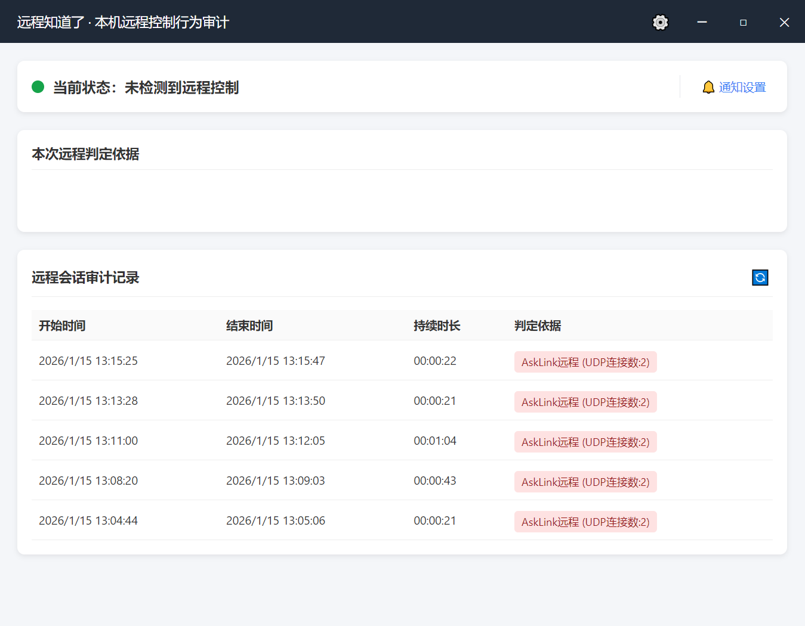
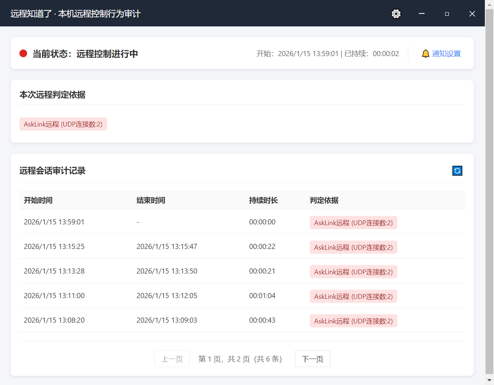
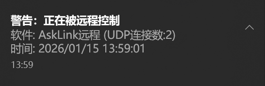
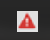
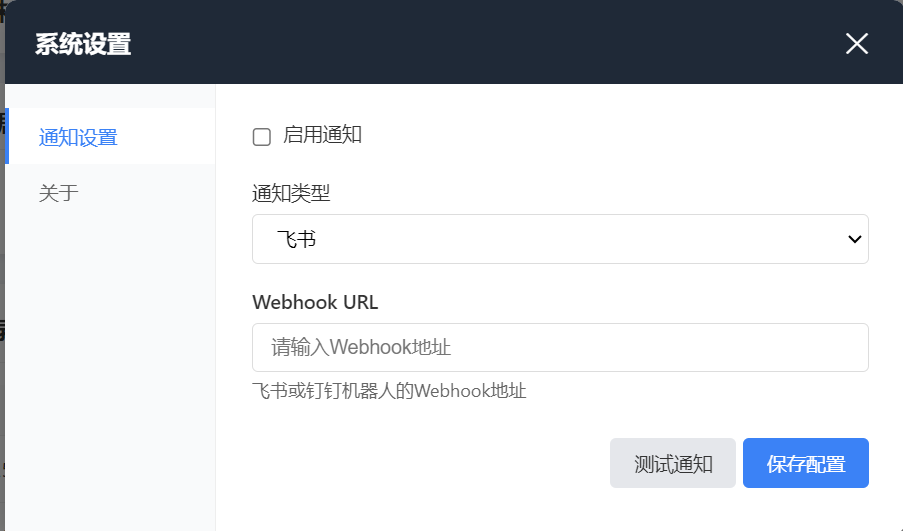
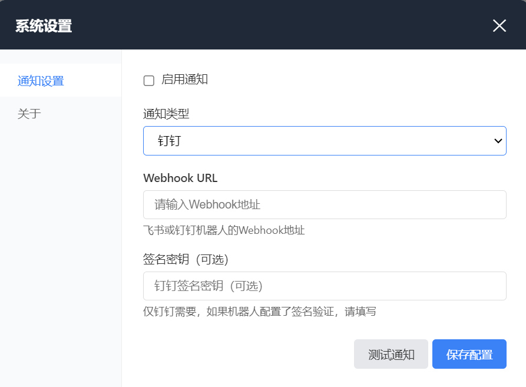

<div align="center">
  
  <h1>RemoteKnown</h1>
  <p>
    <b>Local Terminal Remote Behavior Awareness & Audit System</b>
  </p>
  <p>
    Let you "clearly know if, when, and how you are being remotely controlled", protecting your privacy.
  </p>

  <p>
    <a href="README.md">简体中文</a> | <a href="README_en.md">English</a>
  </p>

  <p>
    <a href="https://github.com/samwafgo/RemoteKnown/blob/main/LICENSE">
      
    </a>
    
    
    
  </p>
</div>

---

## 📖 Introduction

**RemoteKnown** is an application that can monitor the remote control status of your system in real time, recognize a variety of mainstream remote tools (such as ToDesk, Sunlogin, NetEase UU Remote, AskLink Remote, RemoteKankan, etc.), and provide desktop notifications, Feishu/DingTalk alerts, and detailed session audit logs.

## 📸 Interface Preview

### Main Dashboard
| Safe Status | Remote Active |
| :---: | :---: |
|  |  |

### Desktop Notifications
| Remote Start Alert | Remote End Notification |
| :---: | :---: |
|  |  |

### System Tray
| Alert Icon |
| :---: |
|  |

### Notification Settings
| Feishu Config | DingTalk Config |
| :---: | :---: |
|  |  |

## ✨ Key Features

*   **🛡️ Real-time Awareness**: Comprehensive judgment based on multiple signals (Process, Window, Network Port, Session) .
*   **👁️ Wide Support**:
    *   [x] ToDesk
    *   [x] Sunlogin (向日葵)
    *   [x] Windows RDP
    *   [x] NetEase UU Remote (网易UU远程)
    *   [x] AskLink Remote (AskLink远程)
    *   [x] RemoteKankan (远程看看)
*   **📝 Session Auditing**: Automatically records the **start time**, **end time**, **duration**, and **detection source** of each remote session.
*   **🔔 Multi-channel Alerts**:
    *   **Desktop Popup Notifications**
    *   **System Tray Icon Status Change** (Green for Safe, Red for Warning)
    *   **IM Webhook Push** (Supports Feishu/Lark, DingTalk)
*   **🔒 Privacy First**: All data is stored locally in an SQLite database. No sensitive information is uploaded.

## 🚀 Getting Started

### Download
Download the latest installer (`RemoteKnown-Setup-x.x.x.exe`) from any of the following platforms:

*   **GitHub**: [Releases page](https://github.com/samwafgo/RemoteKnown/releases)
*   **Gitee**: [Releases page](https://gitee.com/samwaf/remote-known/releases)
*   **AtomGit**: [Releases page](https://atomgit.com/SamWaf/SamSafe/releases)

### Run
After installation, double-click the desktop icon to start.
*   The application will automatically minimize to the system tray upon startup.
*   The tray icon turns red and shows a tooltip/notification when remote control is detected.
*   Click the tray icon to open the main dashboard for detailed status and history.

## 🛠️ Build from Source

If you are a developer and want to build the project yourself, please follow these steps:

### Prerequisites
*   **Windows 10/11** (Core detection logic relies on Windows API)
*   **Go**: 1.21 or higher
*   **Node.js**: 18 or higher (LTS recommended)
*   **Make** (Optional)

### Build Steps

We provide a one-click build script that handles Go backend compilation and Electron frontend packaging.

**Must run CMD or PowerShell as Administrator (to resolve symlink permission issues):**

```powershell
# 1. Clone the repository
git clone https://github.com/samwafgo/RemoteKnown.git
cd RemoteKnown

# 2. Run the build script
.\build.bat
```

After the build completes, the installer will be located in the `web/dist` directory.

## 📂 Project Structure

```
RemoteKnown/
├── build.bat             # One-click build script (Windows)
├── cmd/                  # Go program entry
├── internal/             # Go core business logic
│   ├── detector/         # Remote feature detection engine
│   ├── server/           # Local HTTP API server
│   └── storage/          # SQLite database operations
├── web/                  # Electron frontend source
│   ├── assets/           # Static assets (Logo, etc.)
│   ├── index.html        # Main HTML
│   └── main.js           # Electron main process
└── README.md             # Project documentation (Chinese)
```

## 🤝 Contribution

Issues and Pull Requests are welcome!

### Repositories
*   **GitHub**: [https://github.com/samwafgo/RemoteKnown](https://github.com/samwafgo/RemoteKnown)
*   **Gitee**: [https://gitee.com/samwaf/remote-known](https://gitee.com/samwaf/remote-known)
*   **AtomGit**: [https://atomgit.com/SamWaf/RemoteKnown](https://atomgit.com/SamWaf/RemoteKnown)

### Communication
Follow our WeChat Official Account for the latest updates and technical discussions:

<div align="center">
  
</div>

## 📄 License

This project is licensed under the [MIT License](LICENSE).
